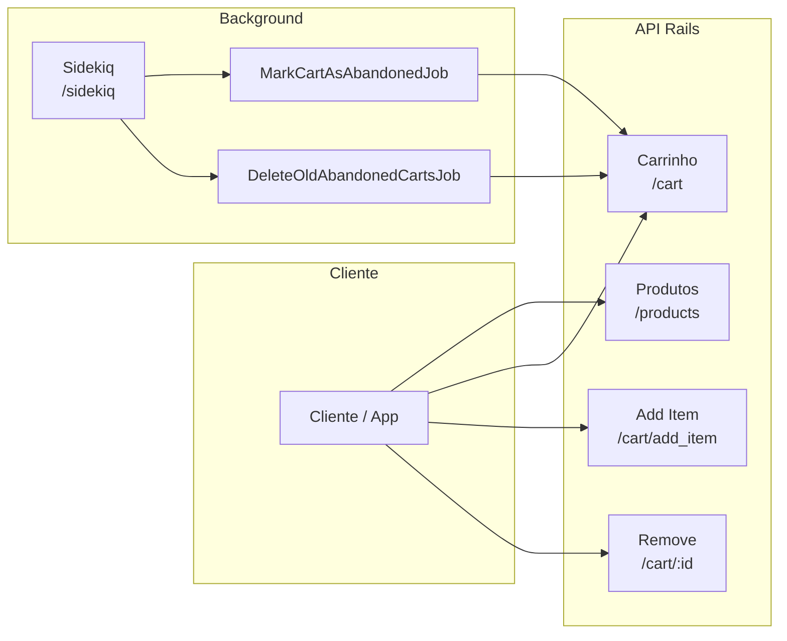
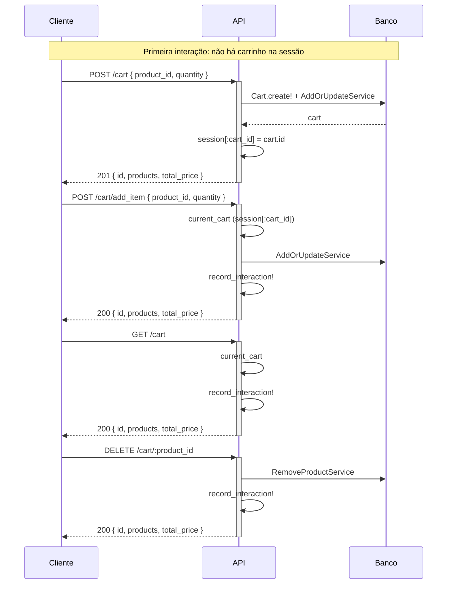
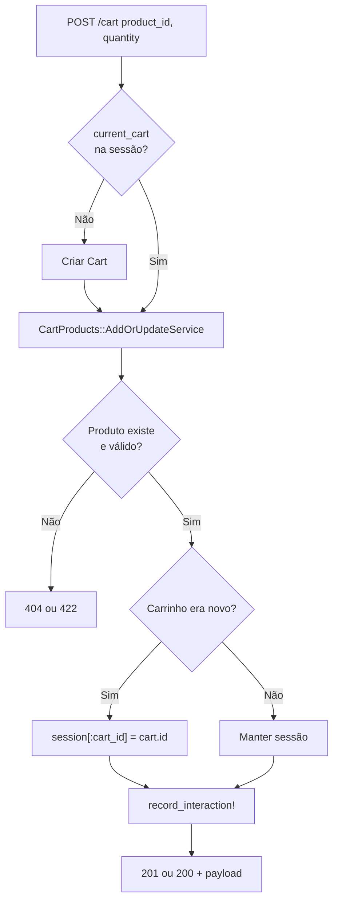
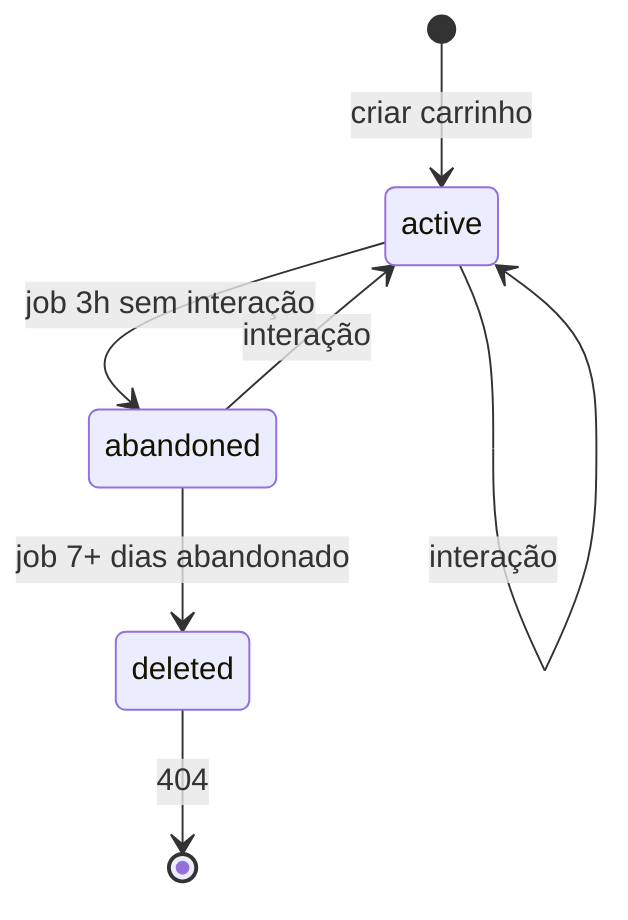
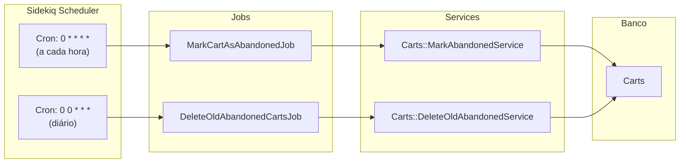
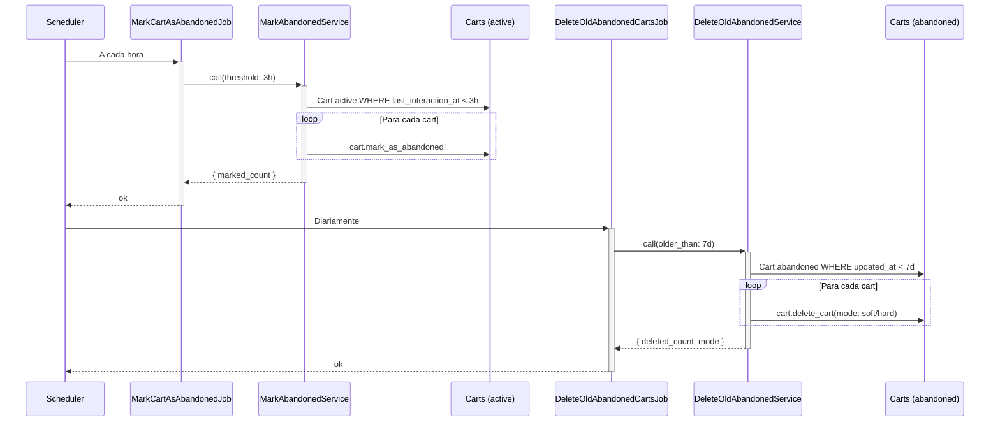
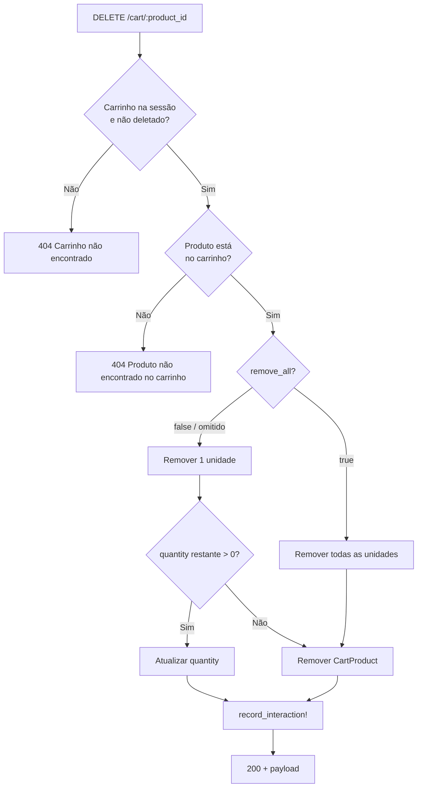

# Diagramas de funcionalidade

Diagramas em [Mermaid](https://mermaid.js.org/) para visualizar fluxos e estados da API de carrinho de compras.

> **Preview no editor:** O preview Markdown do Cursor/VSCode não renderiza Mermaid por padrão. Para ver os diagramas:
> - **Opção 1:** Instale a extensão [Markdown Preview Mermaid Support](https://marketplace.visualstudio.com/items?itemName=bierner.markdown-mermaid) (ou "Mermaid") e reabra o preview.
> - **Opção 2:** Abra o repositório no **GitHub** ou **GitLab** — os diagramas são renderizados automaticamente nos arquivos `.md`.
> - **Opção 3:** Use o [editor online do Mermaid](https://mermaid.live/) colando o conteúdo de cada bloco ` ```mermaid `.

---

## Índice

1. [Visão geral da API](#visão-geral-da-api)
2. [Fluxo do carrinho (cliente)](#fluxo-do-carrinho-cliente)
3. [Fluxo POST /cart (criar ou adicionar)](#fluxo-post-cart-criar-ou-adicionar)
4. [Ciclo de vida do carrinho (estados)](#ciclo-de-vida-do-carrinho-estados)
5. [Jobs de carrinhos abandonados](#jobs-de-carrinhos-abandonados)
6. [Fluxo de remoção de produto](#fluxo-de-remoção-de-produto)

---

## Visão geral da API



---

## Fluxo do carrinho (cliente)

Sequência típica: criar carrinho, adicionar itens, listar, remover. O carrinho é identificado pela sessão (cookie).



---

## Fluxo POST /cart (criar ou adicionar)

Decisão interna: já existe carrinho na sessão? Se não, cria carrinho e adiciona o produto; se sim, apenas adiciona/atualiza o item.



---

## Ciclo de vida do carrinho (estados)

Estados possíveis do carrinho e transições (interação do usuário vs. jobs).



| Transição | Significado |
|-----------|-------------|
| criar carrinho | `POST /cart` com primeiro produto |
| interação | GET/POST/DELETE no carrinho → `record_interaction!` mantém/reativa |
| job 3h sem interação | **MarkCartAsAbandonedJob** (cron horário) |
| job 7+ dias abandonado | **DeleteOldAbandonedCartsJob** (cron diário) |
| 404 | API responde "Carrinho não encontrado" |

---

## Jobs de carrinhos abandonados

Dois jobs agendados via sidekiq-scheduler: um horário (marcar abandonados) e um diário (excluir antigos).



**Fluxo de dados dos jobs:**



---

## Fluxo de remoção de produto

DELETE /cart/:product_id: remoção unitária (padrão) ou total (remove_all=true).



---

## Referências

- [docs/API.md](API.md) — Contratos dos endpoints
- [docs/ABANDONED_CARTS_JOBS.md](ABANDONED_CARTS_JOBS.md) — Configuração dos jobs
- [README.md](../README.md) — Visão geral do projeto
